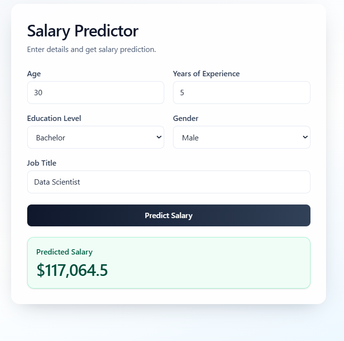

# Salary Prediction App

This project predicts salary from a few input details using a trained machine learning model. The ML part uses linear regression on the salary dataset, with basic preprocessing for education, gender, and job title before prediction. The trained model is connected to a simple form-based interface for end-to-end salary prediction.

## How The ML Works

First, the salary dataset is cleaned and prepared so the model can use it properly. Categorical values like education level, gender, and job title are converted into numeric features, while age and years of experience are kept as numeric inputs. Then a linear regression model is trained to learn the relationship between these features and salary. After training, the model is saved as a pickle file and reused in the app to predict salary from new user input.

## ML Overview

- Dataset: `ml/data/salary.csv`
- Model: Linear Regression
- Saved artifact: `backend/app/model/salary_prediction_model.pkl`
- Prediction flow: user input -> model preprocessing -> trained model -> predicted salary

## Demo

